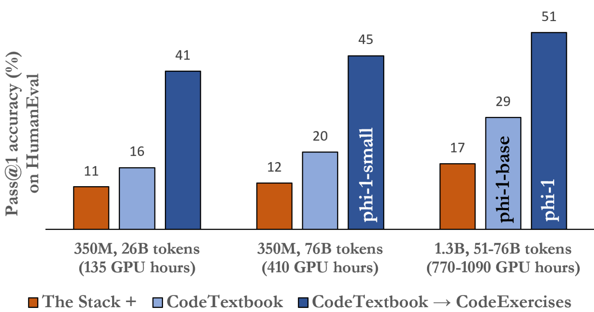

# Attention is all you need

## 1. 緒論（Introduction）

* 文章開篇點明循環神經網絡（RNN），特別是長短期記憶網絡（LSTM）和門控循環神經網絡（GRU），已成為序列建模和轉導問題（如語言建模和機器翻譯）中最先進的方法。
* 然而循環模型的序列特性限制了訓練樣本內的並行化，這在序列較長時變得至關重要，因為內存限制了跨樣本的批次處理，本文提出了一種新的簡單網絡架構——Transformer，它完全依賴於注意力機制（Attention）來繪製輸入和輸出之間的全局依賴關係，避免了循環和卷積。
* 在 8 個 P100 GPU 上進行 12 小時的訓練後，可以在翻譯品質方面達到新的水平。

## 2. 背景（Background）

* 減少序列計算也是其他模型的目標，例如 Extended Neural GPU、ByteNet 和 ConvS2S，它們都使用卷積神經網絡作為基本構建塊，并行計算所有輸入和輸出位置的隱藏表示。
* 然而在這些模型中，關聯兩個任意輸入或輸出位置的信號所需的操作數量會隨著位置之間的距離而增長 （對於 ConvS2S 呈**線性**增長，對於 ByteNet 呈**對數**增長，Transformer 將其減少到恆定的操作次數），儘管以降低有效分辨率為代價，這是由於注意力加權位置的平均化，我們通過 3.2 節中描述的多頭注意力機制來抵消這種影響。
* 自注意力機制已成功應用於各種任務，包括閱讀理解、摘要、文本蘊含和學習任務無關的句子表示 。Transformer 是第一個完全依靠自注意力機制來計算其輸入和輸出的表示，而無需使用序列對齊的 RNN 或卷積的轉導模型。

## 3. 模型架構（Model Architecture）

* Transformer 遵循編碼器-解碼器結構，其中編碼器（**Encoder** ）將輸入序列的符號表示映射到連續表示序列，解碼器（**Decoder**）根據編碼器的輸出生成輸出序列，Transformer 的編碼器和解碼器都使用堆疊的自注意力機制（self-attention）和逐點（point-wise）以及全連接層（fully connected layers），如下圖 1 。

<figure><figcaption></figcaption></figure>

### **3.1 編碼器和解碼器堆棧（Encoder and Decoder Stacks）**

* 編碼器由 N=6 個相同的層組成，每層都有兩個子層，將兩個子層採用殘差連接，然後進行層歸一化多頭、自注意力機制和一個簡單的逐點全連接前饋網絡：
  * 第一個是多頭自註意力機制（multi-head self-attention mechanism）。
  * 第二個是簡單的位置級全連接前饋網路（position-wise fully connected feed-forward network）。
* 解碼器也是由 N=6 個相同的層組成，與編碼器中的每個層中的兩個子層相比，解碼器插入了第三個子層，該子層對編碼器堆棧的輸出執行多頭注意力 ，修改解碼器中的自註意力子層，防止關注後續位置，這種掩蔽與輸出嵌入偏移一個位置的方式，確保位置 i 的預測只能依賴小於 i 的位置的已知輸出。

### **3.2 注意力機制（Attention）**

* 注意力函數可以描述為將查詢和一組鍵值對映射到輸出，其中查詢（query）、鍵（key）、值（value）和輸出都是向量。
* 輸出為值的加權和，其中分配給每個 value 的權重都是由 query 與相應 key 的 compatibility function 計算的。
* 論文中使用的注意力機制稱為缩放點積注意力（Scaled Dot-Product Attention）。

<figure><figcaption></figcaption></figure>

#### **3.2.1 缩放點積注意力（Scaled Dot-Product Attention）**

* 輸入由 queries 和 keys 的維度 $$d_k$$ 以及 value 的維度 $$d_v$$ 組成。
* 計算 queries 與所有 keys 的點積，除以維度的平方根 $$\sqrt(d_k)$$，然後使用 softmax 函數獲得 value 的權重。

$$
Attention(Q, K, V ) = softmax(QK^T/
\sqrt d_k)V
$$

* 與加性注意力（additive attention）相比，缩放點積注意力在實踐中更快、更節省空間，因為它可以使用高度優化的矩陣乘法來實現。
* 為了抵消點積在高維度時變得過大的影響，須將其缩放 $$1/\sqrt(d_k)$$。

#### **3.2.2 多頭注意力（Multi-Head Attention）**

* 將查詢（query）、鍵（key）、值（value）線性投影 h 次到 $$d_k$$和 $$d_v$$維度，分別在這些投影的查詢（query）、鍵（key）、值（value）並行執行注意力函數，產生 $$d_v$$維輸出值，然後將這些值連接起來並再次投影，從而得到最終值。

$$
MultiHead(Q, K, V ) = Concat(head_1, ..., head_h)W^O
$$

$$
wherehead_i = Attention(QW_i^Q, KW_i^K, V_i^W)
$$

* 多頭注意力允許模型共同關注來自不同位置的不同表示子空間的資訊。

#### **3.2.3 注意力機制在模型中的應用 (Applications of Attention in our Model)**

* Transformer 以三種不同的方式使用多頭注意力機制:
  * 編碼器-解碼器注意力（encoder-decoder attention）：queries 來自先前的解碼器層，儲存的 keys 和 values 來自編碼器的輸出，允許解碼器中的每個位置關注輸入序列中的所有位置。
  * 編碼器：keys 和 values 都來自同一個地方，在這種情況下是編碼器中前一层的輸出，允許編碼器中的每個位置關注編碼器中前一層的所有位置。
  * 解碼器：解碼器中的自注意力層允許解碼器中的每個位置關注到該位置及之前所有位置。需要在解碼器中防止資訊向左流動，以保持自回歸的特性。

### **3.3 位置前饋網絡（Position-wise Feed-Forward Networks）**

* 編碼器和解碼器中的每一層都包含一個全連接前饋網絡，該網絡分别且相同地應用於每個位置。
* 該網絡由兩個線性變換組成，中間有一個 ReLU 激活函數。

$$
FFN(x) = max(0, xW_1 + b_1)W_2 + b_2
$$

### **3.4 嵌入和 Softmax (Embeddings and Softmax)**

* 與其他序列轉導模型類似，Transformer 使用學習嵌入將輸入標記和輸出標記轉換為 d 模型維度的向量。
* Transformer 還使用學習的線性變換和 softmax 函數將解碼器輸出轉換為預測的下一個標記概率。

### **3.5 位置編碼（Positional Encoding）**

* 為了讓模型利用序列的順序信息，將 「位置編碼」 新增至編碼器和解碼器堆疊底部的輸入嵌入。
* 本文使用不同頻率的正弦和餘弦函數作為位置編碼，也嘗試使用學習的位置嵌入。
* 發現這兩個版本幾乎產生相同的結果，選擇正弦版本，因為可以允許模型推斷出比訓練期間遇到的序列長度更長的序列長度。

## 4. 為什麼選擇自注意力機制？（Why Self-Attention）

* 計算複雜度：
  * 自注意力層只需固定次數的順序操作即可連接所有位置，自注意力層的計算速度比循環層快。
  * 雖然卷積層可以用更少的順序操作來連接所有位置，但這需要堆疊多層，並會增加網絡中任意兩個位置之間的最長路徑長度，不利於學習長距離依賴關係。
  * 與 RNN 模型相比，即使僅在 40K 個句子的 WSJ 訓練集上進行訓練，Transformer 也優於 BerkeleyParser。
* 並行化：
  * 自注意力層在計算上可以 高度並行化，不需要按照序列順序處理信息。
  * 相比之下，循環層需要逐個處理序列中的每個位置，限制了並行化的程度。
* 長距離依賴關係：
  * 自注意力機制允許模型直接關注序列中任何位置的信息，從而更容易學習長距離依賴關係。
  * 循環層需要通過序列中的所有中間位置傳遞信息，這使得學習長距離依賴關係變得更加困難，並且隨著距離的增加，性能可能會下降。
  * 卷積層雖然可以通過增加卷積核大小或擴張卷積來捕捉長距離依賴關係，但這會增加計算成本和模型複雜度。

## 5. 訓練（Training）

### **5.1 訓練數據和批次處理 (Training Data and Batching)**

* 使用標準的 WMT 2014 英德數據集（包含約 450 萬個句子對）進行訓練，包含 3600 萬個句子，並將標記拆分為 32000 個單字片段詞彙表。
* 句子對按近似序列長度批次處理在一起，每個訓練批次包含一組句子對，其中包含大約 25000 個來源標記和 25000 個目標標記。

### **5.2 硬件和時間安排 (Hardware and Schedule)**

* 在一台配備 8 個 NVIDIA P100 GPU 的機器上訓練模型。

### **5.3 優化器 (Optimizer)**

* 使用 Adam 優化器，並在訓練過程中改變學習率。

### **5.4 正則化 (Regularization)**

* 在訓練期間採用了三種類型的正則化：
* Residual Dropout （殘差丟失）：將丟失應用於每個子層的輸出。
* Label Smoothing（標籤平滑）：在訓練期間，使用值 $$εls=0.1$$的標籤平滑。

## 6. 結果 (Results)

### **6.1 機器翻譯 (Machine Translation)**

* 在 WMT 2014 英德翻譯任務中，大型 Transformer 模型的性能優於之前報告的最佳模型（包括集成模型）超過 2.0 BLEU，創造了 28.4 的全新 BLEU 分數。
* 在 WMT 2014 英法翻譯任務中，大型模型的 BLEU 得分為 41.0，優於之前發布的所有單一模型，而訓練成本不到之前最先進模型的 1/4。

### **6.2 模型變體 (Model Variations)**

* 為了評估 Transformer 不同組件的重要性，論文改變了基本模型的不同之處，測量了英德翻譯在開發集 newstest2013 上的性能變化。

<figure><figcaption></figcaption></figure>

### **6.3 英語成分句法分析 (English Constituency Parsing)**

* 為了評估 Transformer 是否可以泛化到其他任務，論文對英語成分句法分析進行了實驗。
* 結果顯示在表 4 中，表明儘管缺乏針對特定任務的調整，但模型的性能出奇地好，產生的結果優於之前報告的所有模型，除了循環神經網路 。

<figure><figcaption></figcaption></figure>

#### 7. 結論 (Conclusion)

* 本文介紹了 Transformer，這是第一個完全基於注意力的序列轉導模型，它用多頭自注意力機制取代了編碼器-解碼器架構中最常用的循環層。
* 對於翻譯任務，Transformer 的訓練速度明顯快於基於循環層或卷積層的架構。
* 在 WMT 2014 英德和英法翻譯任務中，Transformer 都實現了新的最先進水平。

## 總結

Transformer 是一種新穎的序列轉導模型，它完全依賴注意力機制，避免傳統循環神經網絡的缺點。 它在機器翻譯等任務上取得了最先進的結果，並展現出在其他自然語言處理任務中的巨大潛力。 Transformer 的出現標誌著自然語言處理領域的一個重要里程碑，並為未來的研究開闢了新的方向。
