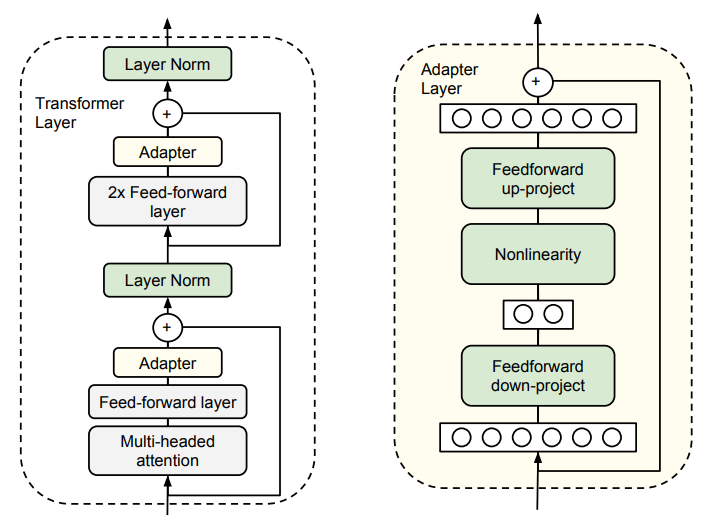

# Adapter

## **摘要 (Abstract)**

* **微調大型預訓練模型是 NLP 中有效的遷移機制**。
* 然而當存在許多下游任務時，**微調會導致參數效率低下**，因為每個任務都需要一個全新的模型。
* 本文提出使用 **Adapter 模組**進行遷移學習，**Adapter 產生一個緊湊且可擴展的模型**，每個任務僅需新增少量可訓練的參數，且新增任務無需重新訪問先前的任務。
* 原始網路的參數保持固定，實現高度的參數共享。
* 實驗證明，在將 BERT 模型遷移到 26 個不同的文本分類任務（包括 GLUE 基準）時，**Adapter 模組在僅增加少量參數的情況下，達到了接近最先進的性能**。
* 在 GLUE 上，Adapter 模組的性能僅比完整微調低 0.4%，但**每個任務僅增加了 3.6% 的參數**，而完整微調則訓練了 100% 的參數。

## **緒論 (Introduction)**

* 從預訓練模型進行遷移學習在許多 NLP 任務中都取得了優異的性能。
* BERT 基於 Transformer ，透過**無監督（unsupervised loss）** 學習在大型文本語料庫上進行訓練，在文本分類和抽取式問答方面達到了當時最先進的水平。
* 本文關注 **Online Setting （任務是依序到來的環境）**，目標是建立一個在所有任務上都表現良好的系統，但**無需為每個新任務訓練一個全新的模型**。
* 本文提出一種**產生緊湊且可擴展的**的遷移學習策略，這些模型在不犧牲性能的情況下，每個任務僅需少量額外參數，且可以**增量訓練以解決新任務，而不會遺忘先前的任務。**

<figure><figcaption>
<strong>圖 1: Adapter 微調和完整微調在準確度和每個任務訓練的特定參數數量之間的權衡</strong>
</figcaption></figure>

* Y 軸根據完整微調的性能進行歸一化，曲線顯示了 GLUE 基準中九個任務的第 20、50 和 80 個性能百分位數，**基於 Adapter 的微調以比完整微調少兩個數量級的訓練參數實現了相似的性能**。

## **NLP 的 Adapter 微調 (Adapter tuning for NLP)**

#### 關鍵特性

* 本文提出了一種在多個下游任務上微調大型文本模型的方法，該方法具有三個關鍵特性：
  1. **達到良好的性能**
  2. **允許按順序訓練任務（無需同時訪問所有數據集）**
  3. **每個任務僅需添加少量額外參數**

這些特性在雲端服務中尤其有用，因為許多模型需要在一個接一個的下游任務上進行訓練，因此需要**高度的參數共享，**&#x70BA;了實現這些特性，本文提出了一種新的 **bottleneck Adapter 模組**。

* vanilla 微調: 通常只修改網路的頂層
* Adapter 微調: 對預訓練網路進行更廣泛的架構修改以適應下游任務
* 使用 Adapter 模組進行微調涉及向模型添加少量新參數，這些參數在下游任務上進行訓練。
* Adapter 微調策略涉及**將新層注入到原始網路中，原始網路的權重保持不變（凍結）**，因此可以被多個任務共享।

<figure><figcaption>
<strong>圖 2 Adapter 模組的架構及其與 Transformer 的整合</strong>
</figcaption></figure>

* **Adapter 模組在每個 Transformer 層中添加了兩次**：在多頭注意力機制後的投影層之後，以及在兩個前饋層之後।
* **Adapter 包含一個 bottleneck 結構**，相對於原始模型中的注意力和前饋層，它包含較少的參數।
* **Adapter 還包含一個 skip-connection**।
* 在 Adapter 微調期間，**綠色標示的層（包括 Adapter、層歸一化參數和最終分類層）會在下游數據上進行訓練**।
* **2.1. Transformer 網路的實例化 (Instantiation for Transformer Networks)**
  * 本文針對文本 Transformer 實現了基於 Adapter 的微調。
  * Transformer 的每個層包含兩個主要的子層：**注意力層和前饋層**।
  * 這兩個子層之後都直接跟著一個將特徵大小映射回層輸入大小的投影層，並且在每個子層上應用一個 **skip-connection**।
  * 每個子層的輸出都饋送到 **層歸一化**।
  * 本文在每個子層之後串聯插入了**兩個 Adapter**।
  * Adapter 直接應用於子層的輸出（在投影回輸入大小之後，但在添加 skip connection 之前），然後 Adapter 的輸出直接傳遞到後續的層歸一化।
  * 為了限制參數數量，本文提出了一個 **bottleneck 架構**।
  * Adapter 首先將原始的 d 維特徵投影到一個較小的維度 m，應用一個非線性激活函數，然後再投影回 d 維।
  * 每個層添加的總參數數量（包括偏差）為 2md + d + m।
  * 透過設定 **m << d**，可以限制每個任務添加的參數數量；實際上，本文使用的參數約為原始模型的 0.5% - 8%।
  * bottleneck 維度 m 提供了一種在性能和參數效率之間進行權衡的簡單方法।
  * Adapter 模組本身內部有一個 **skip-connection**。如果投影層的參數初始化為接近於零，則該模組會被初始化為一個近似的恆等函數।
  * 除了 Adapter 模組中的層之外，本文還**為每個任務訓練新的層歸一化參數**।
* **3. 實驗 (Experiments)**
  * 實驗旨在證明 **Adapter 在文本任務中實現了參數高效的遷移學習**।
  * 在 GLUE 基準上，Adapter 微調的性能僅比 BERT 的完整微調低 0.4%，但**僅增加了完整微調訓練參數的 3%**।
  * 這個結果在另外 17 個公共分類任務和 SQuAD 問答數據集上得到了驗證。
  * 分析表明，基於 Adapter 的微調會**自動關注網路的較高層**।
* **3.1. 實驗設定 (Experimental Settings)**
  * 使用公開預訓練的 **BERT Transformer 網路**作為基礎模型。
  * 對於 BERT 的分類任務，遵循 Devlin 等人 (2018) 的方法，將一個線性層連接到序列的第一個特殊分類標記的嵌入上，以預測類別標籤।
  * 訓練過程也遵循 Devlin 等人 (2018) 的方法，使用 **Adam 優化器**，學習率在前 10% 的步驟中線性增加，然後線性衰減到零।
  * 所有實驗都在 4 個 Google Cloud TPU 上進行，批次大小為 32।
  * 對於每個數據集和演算法，都進行了 **超參數掃描**，並根據驗證集上的準確度選擇最佳模型।
* **3.2. GLUE 基準 (GLUE benchmark)**
  * 首先在 GLUE 上進行評估，使用預訓練的 **BERTLARGE 模型**，該模型包含 24 層，總共有 3.3 億個參數。
  * 對 Adapter 微調進行了小規模的超參數掃描，包括學習率和 epoch 數。
  * 測試了固定 Adapter 大小和每個任務選擇最佳大小（從 {8, 64, 256} 中選擇）兩種方式。
  * 由於訓練不穩定性，每個設定重複運行 5 次並選擇驗證集上最佳的模型।
  * 結果顯示，**Adapter 的平均 GLUE 分數為 80.0，而完整微調為 80.4**。
  * 最佳的 Adapter 大小因數據集而異。
  * 將 Adapter 大小固定為 64 會導致平均準確度略微下降至 79.6。
  * 解決表 1 中的所有數據集，完整微調需要 9 倍的 BERT 總參數量，而 **Adapter 僅需 1.3 倍**।
* **3.3. 額外的分類任務 (Additional Classification Tasks)**
  * 為了進一步驗證 Adapter 可以產生緊湊且高性能的模型，在額外的公開文本分類任務上進行了測試。
  * 這個任務集包含各種不同的任務，訓練樣本數量、類別數量和平均文本長度各不相同。
  * 對於這些數據集，使用 **BERTBASE 模型**。
  * 由於數據集的多樣性，掃描了廣泛的學習率。
  * 由於數據集數量眾多，手動從驗證集學習曲線中選擇了 epoch 數。
  * 為完整微調和 Adapter 微調都選擇了最佳超參數।
  * 除了完整微調之外，還測試了一個基線：**可變微調**，即僅微調頂部的 n 層，其餘層凍結。
  * 測試了不同的 Adapter 大小।
  * 與 GLUE 任務不同，這個任務集沒有全面的最先進結果，因此作者收集了自己的基準性能，透過執行大規模超參數搜索的 Neural AutoML 演算法來達成。
  * 結果顯示，AutoML 基準表明 BERT 模型具有競爭力，且 BERT 模型平均表現更好।
  * **Adapter 微調的性能接近完整微調（落後 0.4%）**।
  * 完整微調需要 BERTBASE 參數量的 17 倍才能解決所有任務，而可變微調透過訓練較少的層略微優於完整微調，平均訓練了 52% 的網路參數，總參數量為 9.9 倍।
  * 然而，**Adapter 提供了更緊湊的模型，每個任務僅引入 1.14% 的新參數，所有 17 個任務的總參數量為 1.19 倍**।
* **3.4. 參數/性能權衡 (Parameter/Performance trade-off)**
  * **Adapter 的大小控制了參數效率**，較小的 Adapter 引入的參數更少，但可能會犧牲性能।
  * 為了探索這種權衡，考慮了不同的 Adapter 大小，並與兩個基線進行比較：**(i) 僅微調 BERTBASE 的頂部 k 層；(ii) 僅微調層歸一化參數**।
  * 學習率在第 3.2 節介紹的範圍內進行調整।
  * 結果顯示，**Adapter 在廣泛的大小範圍內都表現良好，並且比微調頂部幾層所需的參數少兩個數量級**。
  * 單獨調整層歸一化參數雖然參數量很少，但性能很差。
* **圖 3 (Figure 3)**
  * 展示了在每個任務集中（GLUE 和“額外”）**跨所有分類任務聚合的準確度與訓練參數數量的關係**।
  * 比較了不同大小的 Adapter（橙色）與微調不同層數的頂部層（藍色）的性能।
  * 結果表明，在兩種情況下，**Adapter 在比微調少兩個數量級的參數下都產生了良好的性能**。
* **圖 4 (Figure 4)**
  * 更詳細地展示了兩個 GLUE 任務（MNLIm 和 CoLA）的三種方法的驗證集準確度與訓練參數數量的關係：**(i) 不同大小的 Adapter 微調 (橙色)，(ii) 微調不同層數的頂部層 (藍色)，以及 (iii) 僅微調層歸一化參數 (綠色)**।
  * 結果清楚地表明，**對於相似的參數數量，Adapter 微調的性能顯著優於僅微調頂部層**।
* **3.5. SQuAD 抽取式問答 (SQuAD Extractive Question Answering)**
  * 最後，為了驗證 Adapter 在分類以外的任務上的有效性，在 **SQuAD v1.1** 上進行了實驗।
  * 結果顯示，與分類任務類似，**Adapter 在訓練更少參數的情況下達到了與完整微調相當的性能**।
  * 大小為 64 的 Adapter（2% 參數）的最佳 F1 分數為 90.4%，而完整微調為 90.7%।
  * 即使是非常小的 Adapter（大小為 2，0.1% 參數）也能在 SQuAD 上取得 89.9 的 F1 分數।
* **圖 5 (Figure 5)**
  * 展示了 **SQuAD v1.1 驗證集上微調和 Adapter 在準確度與訓練參數數量之間的權衡**।
  * 圖表進一步證實了 **Adapter 在問答任務上的參數效率**。
* **3.6. 分析與討論 (Analysis and Discussion)**
  * 進行了 **消融實驗**，以確定哪些 Adapter 最有影響力，方法是移除一些訓練好的 Adapter 並重新評估模型（不重新訓練）।
  * 結果表明，移除任何單一層的 Adapter 對性能的影響很小।
  * 然而，當移除網路中所有 Adapter 時，性能會大幅下降।
  * 分析還表明，**較低層的 Adapter 的影響小於較高層的 Adapter**，這表明 Adapter 可以自動優先處理較高層।
  * 研究了 **Adapter 模組對神經元數量和初始化尺度的魯棒性**，發現 Adapter 的性能對於較小的初始化標準差是穩定的，並且不同大小的 Adapter 的模型品質也相對穩定।
  * 最後，嘗試了幾種 **Adapter 架構的擴展**，但沒有顯著提高性能，因此推薦使用原始的 bottleneck Adapter 架構。
* **圖 6 (Figure 6)**
  * 左側和中間的熱力圖顯示了在 MNLIm 和 CoLA 上移除連續層範圍內的訓練好的 Adapter 後驗證準確度的相對下降，強調了較高層的重要性।
  * 右側的圖表顯示了使用不同初始權重大小的 Adapter 的 BERTBASE 性能।
* **圖 7 (Figure 7)**
  * 展示了在不同學習率下，Adapter 和微調頂部層的最佳模型的性能।
* **4. 相關工作 (Related Work)**
  * 討論了 Adapter 微調與 **預訓練文本表示（特徵提取）、完整微調、多任務學習 (MTL)、持續學習以及視覺領域的遷移學習** 的相關性।
  * 強調了 Adapter 相對於這些方法的優勢，例如更高的參數效率、無需同時訪問所有任務的能力以及避免災難性遺忘。
  * 還提到了同時期關於 BERT 的類似想法的工作。
* **致謝 (ACKNOWLEDGMENTS)**
  * 感謝了提供有益意見和討論的人員。
* **參考文獻 (References)**
  * 列出了引用的學術論文。
* **補充材料 (Supplementary Material)**
  * 提供了**額外的文本分類任務的詳細資訊**，包括數據集統計、訓練所需的 epoch 數以及 AutoML 基線模型的參數搜索空間和選定的參數。
  * 還測試了 **Adapter 和微調對學習率的魯棒性**।

總結來說，這篇論文強烈主張 **Adapter 模組是一種非常有效且參數高效的遷移學習方法**，特別適用於需要處理多個 NLP 任務且希望模型保持緊湊和可擴展的場景。相較於傳統的完整微調，Adapter 模組在性能上僅有微小的差距，但**顯著減少了每個新任務所需的訓練參數數量**，並允許**順序地學習新任務而不會影響先前任務的知識**。
